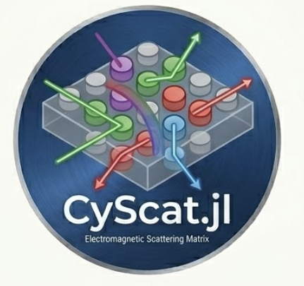

<div align="center">
  
  <h1>CyScat — Python / GPU</h1>
  <p><em>Electromagnetic scattering matrix computation for periodic arrays of cylinders</em></p>
</div>

Python translation of the MATLAB CyScat package originally developed by **Curtis Jin**, **Prof. Raj Rao Nadakuditi**, and **Prof. Eric Michielssen** at the University of Michigan.

Translated to Julia and Python by **Thirulok Sundar**, with the help of [Claude](https://claude.ai).

---

## Overview

CyScat computes the **S-matrix** of a periodic slab of infinite dielectric or PEC cylinders using the
T-matrix multiple scattering method. The S-matrix maps input Floquet modes to output Floquet modes and
encodes all transmission and reflection properties of the structure.

Given the S-matrix you can:
- Compute transmission/reflection for any incident wavefront
- Find **open eigenchannels** (modes that pass through with near-perfect transmission) via SVD
- Scale to thousands of cylinders using **multi-GPU cascade** on HPC clusters

## Features

- **S-matrix computation** — multiple scattering theory with Modified Shanks Transformation for convergence acceleration
- **Cascade** — combine S-matrices via the Redheffer star product for multi-layer structures
- **Matrix derivatives** — ∂S21/∂x, ∂S21/∂λ, ∂S21/∂n via central finite differences
- **JAX AD for n / r** — `jax.grad` through the precomputed T-matrix path for refractive index and radius optimization
- **Multi-GPU / HPC** — partition large arrays across nodes, compute S-matrices in parallel, cascade results (CuPy backend)
- **Wave field visualization** — animated wave field showing normal incidence vs. optimal wavefront
- **Wigner-Smith matrix** — time-delay eigenvalues from Q = -iS⁻¹ ∂S/∂ω via finite differences

## Project Structure

```
CyScat/
├── Scattering_Code/                       Core scattering algorithms
│   ├── smatrix.py                           S-matrix generation (main entry point)
│   ├── smatrix_cascade.py                   Auto-cascade for large arrays (multi-GPU)
│   ├── cascadertwo.py                       Redheffer star product (two S-matrices)
│   ├── transall.py                          Translation matrix with Shanks acceleration
│   ├── sall.py                              Mie scattering coefficients (Bessel/Hankel)
│   ├── vall.py                              Plane wave → cylinder harmonic expansion
│   ├── scattering_coefficients_all.py       Project scattered field onto Floquet modes
│   ├── smatrix_parameters.py                Spectral/spatial parameter setup
│   ├── modified_epsilon_shanks.py           Modified epsilon Shanks transformation
│   ├── ky.py                                Floquet y-wavenumber
│   ├── bessel_jax.py                        JAX-compatible Bessel/Hankel functions
│   └── gpu_backend.py                       JAX/NumPy/CuPy backend selection
│
├── examples/
│   ├── generate_s_matrix_1layer_dielectric/          Dielectric cylinders: geometry, S21 SVD
│   ├── generate_s_matrix_1layer_pec/                 PEC cylinders: geometry, unitarity, S21 SVD
│   ├── generate_s_matrix_cascaded_layers_dielectric/ Dielectric cascade (2, 10, 20 layers)
│   ├── generate_s_matrix_cascaded_layers_pec/        PEC cascade (2, 10, 20 layers)
│   ├── multiple_cyl_cascade/                         Large-array cascade (100+ cylinders)
│   ├── differentiable_s_matrix_demo/                 ∂S21/∂x, ∂S21/∂λ, ∂S21/∂n via finite differences
│   ├── differentiable_s_matrix_wigner_smith/         Wigner-Smith time-delay via ∂S/∂ω (finite differences)
│   ├── optimize_refractive_index_and_radius/         Adam optimization of n and r (JAX grad)
│   ├── generate_wave_demo_dielectric/                Wave field animation — dielectric cylinders
│   ├── generate_wave_demo_pec/                       Wave field animation — PEC cylinders
│   └── maze_s_matrix_wavefront_optimization/         PEC maze eigenchannel routing
│
├── notebooks/
│   └── cyscat_demo.ipynb                    Interactive demo notebook
│
├── compute_ncyl.py                         Single-node multi-GPU computation
├── compute_ncyl_multi_node.py              Multi-node computation (MPI + CuPy)
├── compute_svd_trial.py                    SVD computation for statistics
├── combine_svd.py                          Combine SVD results across trials
├── get_partition.py                        S-matrix block extraction (S11/S12/S21/S22)
└── position_generator.py                   Random cylinder placement
```

## Setup

### Local

```bash
pip install -r requirements.txt
```

### Great Lakes HPC (GPU)

One-time setup — creates a virtual environment with CuPy for GPU acceleration:

```bash
bash setup_greatlakes.sh
```

This loads `python/3.10` and `cuda/12.1`, creates `~/cyscat_env`, and installs `numpy`, `scipy`, `matplotlib`, and `cupy-cuda12x`.

## Usage

### Compute an S-matrix

```python
from Scattering_Code.smatrix import smatrix
from Scattering_Code.smatrix_parameters import smatrix_parameters

sp = smatrix_parameters(wavelength, period, phiinc,
                        1e-11, 1e-4, 5, 3, 1000, 3, 5, 1, period/120)
S, _ = smatrix(clocs, cmmaxs, cepmus, crads, period, wavelength, nmax, thickness, sp, "On")
S21 = S[nm:, :nm]
tau = np.linalg.svd(S21, compute_uv=False)
```

### Cascade layers

```python
from Scattering_Code.cascadertwo import cascadertwo

S_total, d_total = cascadertwo(S1, d1, S2, d2)
```

### Optimize refractive index with JAX

```python
import jax
from Scattering_Code.smatrix import smatrix_precompute, smatrix_from_precomputed

precomp = smatrix_precompute(clocs, cmmaxs, period, wavelength, nmax, thickness, sp, "On")

def objective(n_val):
    cepmus_j = jnp.full((NUM_CYL, 2), jnp.array([n_val**2, 1.0]))
    S = smatrix_from_precomputed(precomp, cmmaxs, cepmus_j, crads, wavelength, "On")
    return jnp.sum(jnp.abs(S[nm:, :nm] @ x_vec)**2).real

grad_n = jax.grad(objective)
```

## Running on Great Lakes HPC

CyScat supports multi-GPU computation on the University of Michigan Great Lakes cluster using CuPy for GPU-accelerated linear algebra.

### Single-Node GPU Job

```bash
sbatch run_job.sh              # default: 5000 cylinders, 4 GPUs
sbatch run_job.sh 2500         # custom cylinder count
```

- **Partition:** `spgpu` | **GPUs:** 4 (V100) | **Memory:** 48 GB | **Time:** 1 hour

### Multi-Node GPU Job

```bash
sbatch run_multinode.sh
```

- **Partition:** `spgpu` | **Nodes:** 2 | **GPUs:** 8 per node | **Time:** 6 hours

### SVD Distribution Statistics

```bash
sbatch svd_array_job.sh
```

Runs `compute_svd_trial.py` over many random cylinder realizations; post-process with `python combine_svd.py`.

## Credits

- Original MATLAB implementation: **Curtis Jin**, **Prof. Raj Rao Nadakuditi**, **Prof. Eric Michielssen**, University of Michigan
- Translated to Julia and Python by **Thirulok Sundar**, with the help of [Claude](https://claude.ai)

## License

MIT
